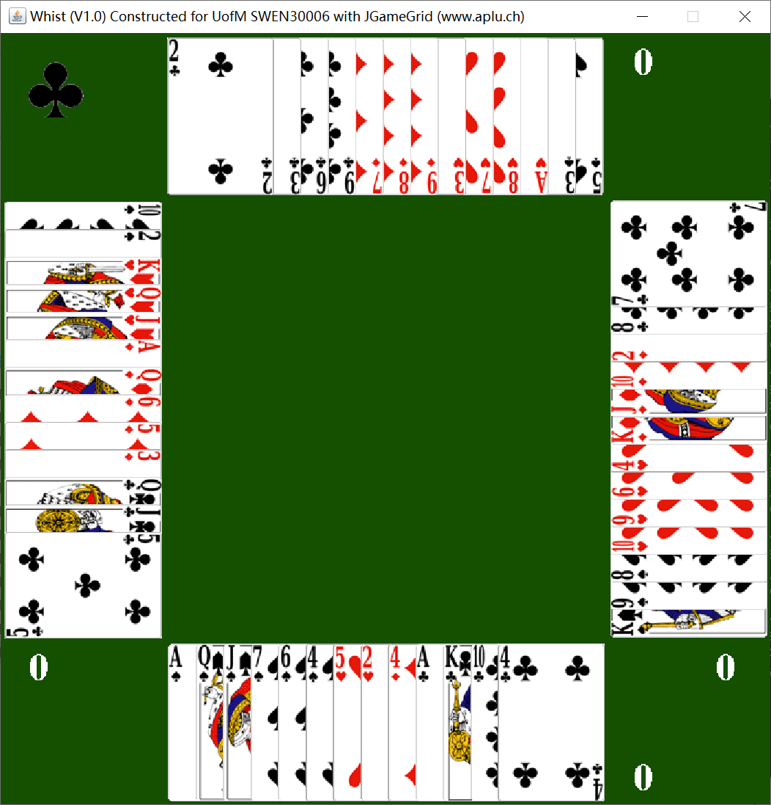

# SWEN30006-2020-S1
##### Whist Poker Game Architecture Design, (Java, UML, Design Patterns)  Refactored the object-oriented design of the original game and implementations using design patterns with UML to leverage the overall configurability and maintainability; extended the Java-based game by adding NPCs with various playing styles.

---------

The game rule is well-described on this webpage:https://bicyclecards.com/how-to-play/whist/

- The game mode was managed in the file called **'whist.properties'**, and there are three mode of play **'Legal', 'Original', 'Smart'**
- To change the mode of game, let's say you want to play against the smart robot, simply copy the content from **'smart.properties'** to **'whist.properties'**
- A screenshot of a typical game

